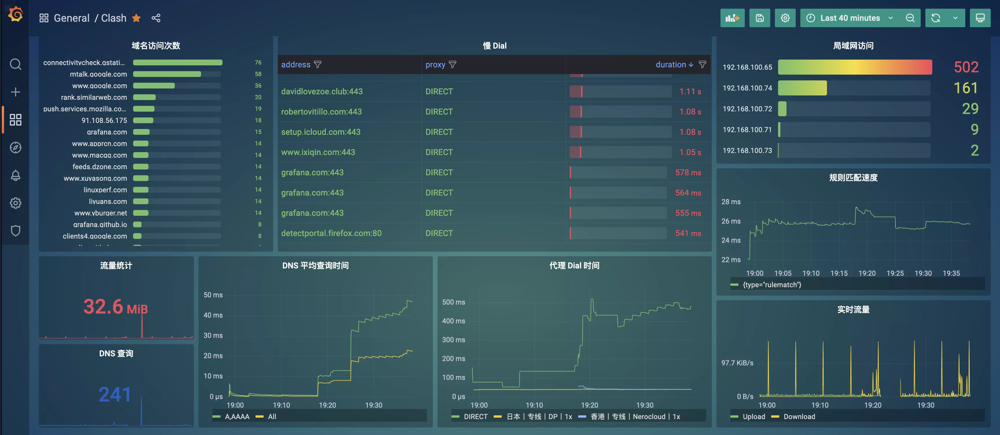

# Clash Tracing Dashboard

Clash 监控面板，基于 [Dreamacro/clash-tracing](https://github.com/Dreamacro/clash-tracing)
和 [yangchuansheng/clash-tracing](https://github.com/yangchuansheng/clash-tracing)；区别在于去掉了 websocat 和 vector 依赖

### Screenshot



### 快速使用

1. Clash 开启 Profile

在 Clash Premium 版本的配置文件中加入以下配置

```yaml
profile:
  tracing: true
```

2. 使用 Docker Compose 启动

```yaml
version: '3'
services:
  loki:
    image: grafana/loki
    container_name: loki
  grafana:
    image: grafana/grafana-oss:latest
    container_name: grafana
    ports:
      - "3000:3000"
  clash-tracing:
    image: hellowoodes/clash-tracing
    container_name: clash-tracing
    environment:
      CLASH_HOST: 'host.docker.internal:9090'
      CLASH_TOKEN: '123456'
      LOKI_ADDR: 'http://loki:3100/loki/api/v1/push'
#      CLICKHOUSE_ADDR: 192.168.2.4:9004
#      CLICKHOUSE_PASSWORD: password
#      CLICKHOUSE_USERNAME: default
#      CLICKHOUSE_DATABASE: clash
```

3. 导入 Grafana 面板

将 panels 目录下面的 json 文件导入到 Grafana 面板中即可